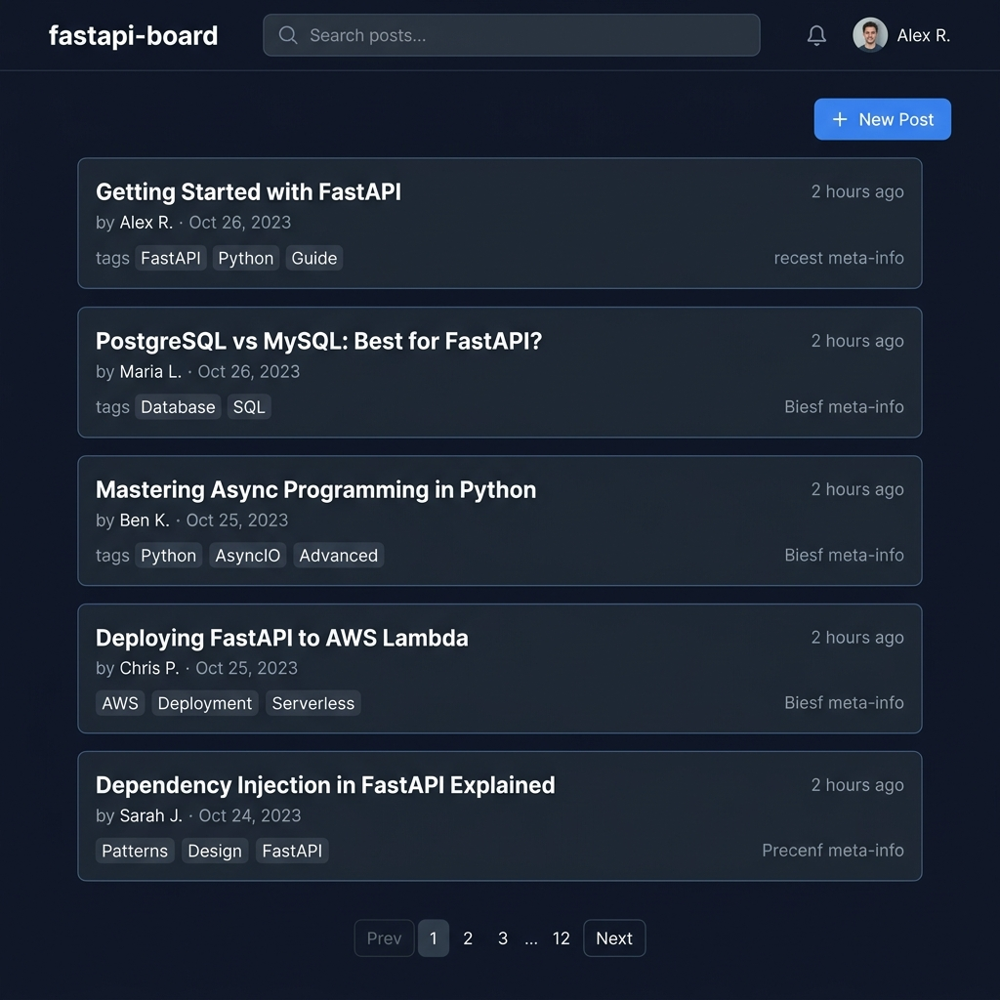

<h1 align="center">⚡ fastapi-board</h1>

<p align="center">
  A minimal yet production-ready bulletin-board REST API built with FastAPI, asyncpg, and PostgreSQL — fully containerised with Docker Compose and paired with a Next.js 14 frontend.
</p>

<p align="center">
  <a href="https://github.com/livinglifeincolor/opensourceprogramming/actions/workflows/docs.yml">
    
  </a>
  
  
  
  
  
  
</p>

<p align="center">
  <a href="https://livinglifeincolor.github.io/opensourceprogramming/"><strong>📄 Sphinx Docs</strong></a>
  ·
  <a href="http://localhost:8000/docs"><strong>🔌 Swagger UI</strong></a>
  ·
  <a href="http://localhost:8000/redoc"><strong>📘 ReDoc</strong></a>
</p>

---

## 📸 Preview



---

## ✨ Features

| Feature | Detail |
|---------|--------|
| **CRUD** | Create, read, update (partial), delete posts |
| **Pagination** | `page` + `size` query parameters on list endpoint |
| **Full-text search** | Case-insensitive keyword search via PostgreSQL `ILIKE` |
| **Validation** | Pydantic v2 field constraints — title ≤ 100 chars, content ≥ 10 chars |
| **Partial update** | Only supplied fields are overwritten (`PostUpdate.apply_to`) |
| **Raw SQL** | asyncpg connection pool — no ORM, full query control |
| **Testing** | 20 async unit tests with pytest-asyncio (no real DB required) |
| **API docs** | Auto-generated Swagger UI + ReDoc with rich examples |
| **Code docs** | Sphinx HTML site auto-deployed to GitHub Pages |

---

## 🛠 Tech Stack

| Layer | Technology |
|-------|-----------|
| **Backend** | FastAPI 0.115, asyncpg, PostgreSQL 16 |
| **Frontend** | Next.js 14 (App Router), TailwindCSS v4, TypeScript |
| **Infra** | Docker Compose |
| **Testing** | pytest, pytest-asyncio, httpx (ASGI transport) |
| **Docs** | Sphinx + furo theme → GitHub Pages |

---

## 🚀 Quick Start

> **Prerequisites**: Docker and Docker Compose installed.

```bash
git clone https://github.com/livinglifeincolor/opensourceprogramming.git
cd opensourceprogramming/fastapi-board
docker compose up --build
```

| Service | URL |
|---------|-----|
| Frontend (Next.js) | <http://localhost:3000> |
| Swagger UI | <http://localhost:8000/docs> |
| ReDoc | <http://localhost:8000/redoc> |
| Health check | <http://localhost:8000/health> |

---

## 🧑‍💻 Local Development

### Backend

```bash
cd backend
python -m venv .venv
source .venv/bin/activate        # Windows: .venv\Scripts\activate
pip install -r requirements.txt
cp .env.example .env             # set DATABASE_URL
uvicorn app.main:app --reload
```

### Frontend

```bash
cd frontend
npm install
cp .env.local.example .env.local # set NEXT_PUBLIC_API_URL
npm run dev
```

---

## 🔌 API Reference

Interactive documentation is available at **`/docs`** (Swagger UI) and **`/redoc`** (ReDoc) when the server is running.

| Method | Endpoint | Description |
|--------|----------|-------------|
| `GET` | `/api/posts?page=1&size=10` | Paginated post list |
| `GET` | `/api/posts/count` | Total post count |
| `GET` | `/api/posts/search?q={keyword}` | Keyword search |
| `POST` | `/api/posts` | Create a post |
| `GET` | `/api/posts/{id}` | Get a single post |
| `PUT` | `/api/posts/{id}` | Partial update |
| `DELETE` | `/api/posts/{id}` | Delete a post |
| `GET` | `/health` | Liveness probe |

### Example: Create a Post

```bash
curl -X POST http://localhost:8000/api/posts \
  -H "Content-Type: application/json" \
  -d '{"title": "Hello World", "content": "My first post on fastapi-board!"}'
```

```json
{
  "id": 1,
  "title": "Hello World",
  "content": "My first post on fastapi-board!",
  "created_at": "2025-03-01T09:00:00Z"
}
```

---

## 📄 Documentation

| Resource | URL |
|----------|-----|
| Sphinx technical docs (GitHub Pages) | <https://livinglifeincolor.github.io/opensourceprogramming/> |
| Swagger UI (local) | <http://localhost:8000/docs> |
| ReDoc (local) | <http://localhost:8000/redoc> |

The Sphinx site is built automatically from Python docstrings on every push to `main` via GitHub Actions.

---

## 🧪 Testing

```bash
cd backend
pytest tests/ -v
```

All 20 tests run without a real database — a `FakePool` / `FakeConn` fixture intercepts asyncpg calls.

```
tests/test_posts.py  ..........  13 passed
tests/test_search.py .......     7 passed
```

---

## 📁 Project Structure

```
fastapi-board/
├── backend/
│   ├── app/
│   │   ├── main.py          # FastAPI app, CORS, lifespan hooks
│   │   ├── database.py      # asyncpg connection pool + schema init
│   │   ├── schemas.py       # Pydantic v2 models (validation + serialisation)
│   │   └── routers/
│   │       └── posts.py     # CRUD + search endpoints with OpenAPI metadata
│   ├── docs/                # Sphinx configuration
│   │   ├── conf.py
│   │   ├── index.rst
│   │   └── modules/
│   ├── tests/
│   │   ├── test_posts.py
│   │   └── test_search.py
│   ├── conftest.py          # FakePool / FakeConn fixtures
│   ├── requirements.txt
│   └── Dockerfile
├── frontend/
│   ├── app/
│   │   ├── page.tsx              # Post list with pagination
│   │   ├── new/page.tsx          # Create post form
│   │   └── posts/[id]/
│   │       ├── page.tsx          # Post detail
│   │       └── edit/page.tsx     # Edit form
│   ├── components/
│   │   ├── PostForm.tsx          # Shared form component
│   │   ├── PostCard.tsx
│   │   ├── PostActions.tsx       # Edit / Delete buttons
│   │   └── Pagination.tsx
│   ├── lib/api.ts                # Typed API client
│   └── Dockerfile
├── docs/
│   └── assets/
│       └── screenshot.png
└── docker-compose.yml
```

---

## 📝 License

Distributed under the [MIT License](LICENSE).
